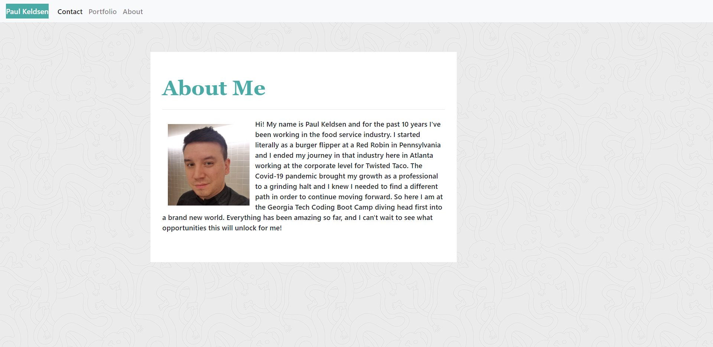

# My Portfolio

## Description

The goal of this project was to to be able to design and build a series of webpages to act as my professional portfolio.  Currently, this portfolio is full of placeholder images, but in the future it will be updated to include finished projects, up to date social media, and more.  The main focus of this project was to develop skills in page layout with reactive elements utilizing Bootstrap's tools. 

## Installation

The repository for this project can be found at: https://github.com/Pkeld148/my-portfolio

## Usage

The user can go to https://pkeld148.github.io/my-portfolio/ and begin navigating the pages of the portfolio from there.  

## Credits

I would like to thank the members of the Georgia Tech Boot Camp for their many solutions offered in both the Slack and Discord channels.

## License

Licensed under the [MIT](https://github.com/Pkeld148/my-portfolio/blob/main/LICENSE) license.